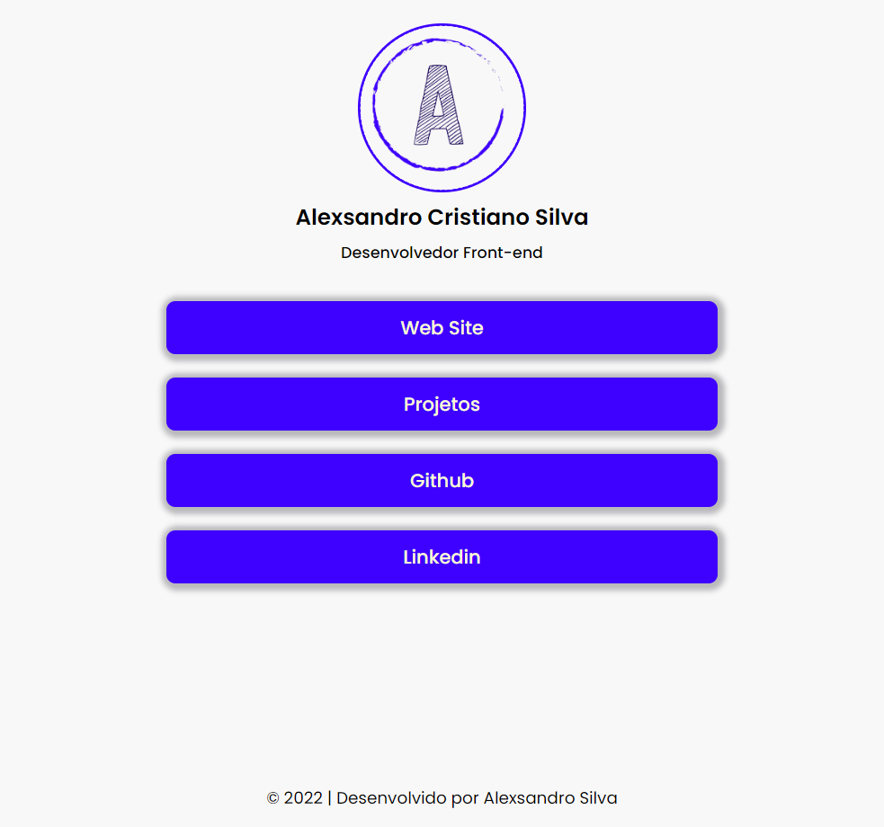

# PitStop

### Descrição do Projeto;

Projeto construido em Html com Css totalmente responsivo. Ele serve como link para as principais redes sociais e projetos pessoas. Atualmente esta disponivel no [neste link](https://pitstopdev.netlify.app/).

### Status do Projeto

Projeto encontra-se na versão 2, e não há planejamento para futuras features.

### Acesso ao Projeto;

Acesse o site [pitstop](https://pitstopdev.netlify.app/).

### Tecnologias utilizadas;

- HTML
- CSS

### Licença

Não tem licença contratada.
